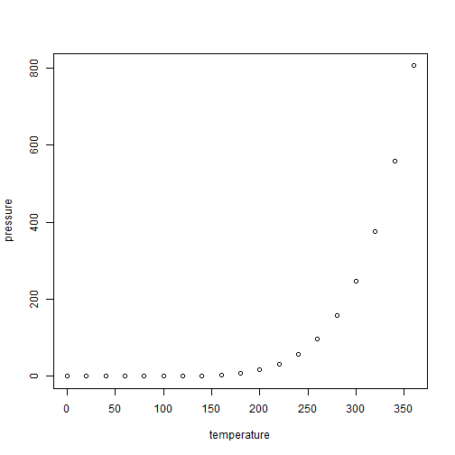

# rastrs2vectrs

Code including examples for extracting Copernicus's ERA5 raster data to vector data

Steps:

1)  Download this package to your local machine with `devtools::install_github("stallman-j/rastrs2vectrs")` 
2)  Open `rastrs2vectrs/code/00_startup.R`

Change the following file paths to your machine's:

```         
home_folder   #set to wherever you downloaded the era5-extraction repository
data_folder   #set to wherever you're going to have as your primary data folder
data_external #useful sometimes to have an external hard drive or another place to store big data, since shapefiles get large. If you don't #use an external hard drive, just set this to whatever file path you used for data_folder.
```

In the section that starts with "Turning on scripts", set the local `startup_create_folders_general` to 1 and set `startup_download_functions_general` to 1 and ensure that all the other locals are set to 0. Run the script.

Then turn `startup_create_folders_general` to 0. 
Also turn`startup_map_functions_general` and `startup_parallel_functions_general` to 1. This startup script `00_startup.R` gets called at the beginning of each sub-file at present so it's a bit of a waste to tell it to keep checking whether it needs to create the folders. Once (if) you have an entire project's workflow you can just call it once in the master script: `00_master_run-of-show.R`.

My personal work sequence sets the `home_folder` path at the top of each script I'm working with; alternatively you could rejig things to make `home_folder` your project directory and avoid having to think about this line; or when you're running the entire project at once you could remove these.

3)  Get your account information set up to download the precipitation (or whatever other ERA5 reanalysis variable) data

How-to:

a)  register for an account at <https://cds.climate.copernicus.eu/#!/home>

b)  once logged in, copy from this URL <https://cds.climate.copernicus.eu/api-how-to> the code which is two lines consisting of the following into a .txt file

```         
url: YOUR_URL_HERE
key: YOUR_KEY_HERE
```

Save this file with "File name" as ".cdsapirc" and "Save as Type" to "All Files" into (most likely if on Windows) `C:\Users\Username` folder otherwise your `%USERPROFILE$\.cdsapirc` file (note this generally assumes you're using a Windows; I haven't tested on a Mac)

<https://confluence.ecmwf.int/display/CKB/How+to+install+and+use+CDS+API+on+Windows> (from <https://confluence.ecmwf.int/pages/viewpage.action?pageId=139068264> )

c)  go into Copernicus and decide what information you want. For example if you want the monthly mean precipitation, use the link below. If you want annual precipitation, hold your horses, we'll get to that. It's not available just for download.

<https://cds.climate.copernicus.eu/cdsapp#!/dataset/reanalysis-era5-single-levels-monthly-means?tab=form>

Choose NETCdf since that's easier to bring into R with metadata. At the bottom click "Show API request". Copy that code.

d)  paste this API request code into a .py file. Alternatively you can paste it into a .txt file which is saved as e.g. "example_cdsapi.py" and in files "All File Types". Save this into the folder which is your `code_download` folder (set in step 2, implicitly after setting `home_folder`).

There are other ways you could get this download, e.g. following the below. <https://confluence.ecmwf.int/display/CUSF/Download+CDS+ERA5+data+using+R>

4)  Open `rastrs2vectrs/code/01_download-datasets.R` and run the script (after you've changed `home_folder` again at the top). This will download 
a) the entire GADM global administrative boundaries dataset
b) the ERA5 reanalysis precipitation data from Copernicus
c) a free set of cities from SimpleMaps 

into the `data_external_raw` path which was set in step 2)


5) Open `02_clean_era5.R`

If you're NOT using total precipitation and you didn't follow my naming conventions in step 3), you'll most likely just want to follow this to see what the clean_era5 function is doing and then set up a script with the clean_era5 function.

The precipitation data NCDF format downloads both a real-time estimate and a reanalyzed; this leads to there being twice as many raster layers as we need. Alternatively if you did a bulk download from the API above of multiple variables, you can modify this code to choose which variables you'd like to save as a single raster stack.

If you just want the monthly average precipitation and you followed step 3) with my suggested setup, just run the script. 

You can comment out the plots at the end if you already get the point of doing rotations, but if the idea of rotating rasters isn't clear to you take a look at those plots so you can see why we so commonly need to manipulate climate rasters to make it sensible to project onto points or polygons.


6) Open `02_clean_polygons.R`

This assumes you want to generate .rds files of ALL the GADM global administrative boundaries at ALL levels (level 1 being the state-province, level 2 being like the prefecture; level 3 like a county; and on down to level 6 which is missing for many countries)

If this assumption is correct and you're happy having a nice handy global shapefile dataset, just run this as-is. But it'll take a little while (to-do: how long to run?)

7) Open `02_clean_points.R`


TO DO:


## decide what to keep of the following
---
output: github_document
---

<!-- README.md is generated from README.Rmd. Please edit that file -->


# rastrs2vectrs

<!-- badges: start -->
<!-- badges: end -->

The goal of rastrs2vectrs is to ...

## Installation

You can install the development version of rastrs2vectrs like so:

``` r
# FILL THIS IN! HOW CAN PEOPLE INSTALL YOUR DEV PACKAGE?
```

## Example

This is a basic example which shows you how to solve a common problem:


```r
library(rastrs2vectrs)
## basic example code
```

What is special about using `README.Rmd` instead of just `README.md`? You can include R chunks like so:


```r
summary(cars)
#>      speed           dist       
#>  Min.   : 4.0   Min.   :  2.00  
#>  1st Qu.:12.0   1st Qu.: 26.00  
#>  Median :15.0   Median : 36.00  
#>  Mean   :15.4   Mean   : 42.98  
#>  3rd Qu.:19.0   3rd Qu.: 56.00  
#>  Max.   :25.0   Max.   :120.00
```

You'll still need to render `README.Rmd` regularly, to keep `README.md` up-to-date. `devtools::build_readme()` is handy for this.

You can also embed plots, for example:

<div class="figure">

<p class="caption">plot of chunk pressure</p>
</div>

In that case, don't forget to commit and push the resulting figure files, so they display on GitHub and CRAN.
